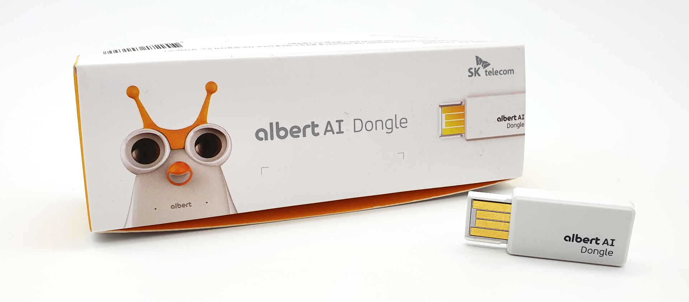
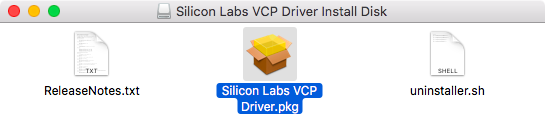

# SW 프로그래밍을 위한 BLe Bridge 동글 USB 드라이버

USB to BLE Bridge 동글은 블루투스 4.0 BLE 패킷을 시리얼 통신 패킷으로 변환해 주는 장치입니다.





시작하기 전 
--
- USB 동글을 PC의 USB 단자에 꽂기 전에 디바이스 드라이버가 먼저 설치되어 있어야 합니다.
- 알버트 코딩 소프트웨어를 먼저 설치하였다면 동글의 디바이스 드라이버도 같이 설치되기 때문에 따로 설치하지 않아도 됩니다.


다운로드
--
- [윈도우 7 이상](./CP210x_Windows_Drivers.zip)
- [윈도우 XP · 비스타](./CP210x_VCP_Windows.zip)
- [OSX](./Mac_OSX_VCP_Driver.zip)
- [리눅스 3.x.x](./device-driver-linux.2.6.x.tar.gz)
- [리눅스 2.6.x](./device-driver-linux.3.x.x.tar.gz)


윈도우 설치방법
--
- 내려 받은 ZIP 파일의 압축을 풉니다.
- 압축을 푼 폴더에 있는 exe 파일을 더블 클릭하여 설치합니다.


  - 윈도우 32비트: CP210xVCPInstaller_x86.exe
  - 윈도우 64비트: CP210xVCPInstaller_x64.exe

OSX 설치방법
--
- 내려 받은 ZIP 파일의 압축을 풉니다.
- SiLabsUSBDriverDisk.dmg 파일을 더블 클릭하여 디스크 이미지 파일을 엽니다.
- Silicon Labs VCP Driver.pkg 파일을 더블 클릭하여 설치합니다.





리눅스 설치방법
--
- 터미널을 열고 tar.gz 파일을 내려 받은 폴더로 이동합니다.
- 터미널에 아래의 명령을 입력하여 압축을 풉니다.


  + 리눅스 3.x.x 버전의 경우
  ```
  tar xvfzp device-driver-linux.3.x.x.tar.gz
  ```
  + 리눅스 2.6.x 버전의 경우
  ```
  tar xvfzp device-driver-linux.2.6.x.tar.gz
  ```
  
  
- drivers 폴더가 생성되었는지 확인합니다.
- 터미널에서 root 계정으로 로그인합니다.
- drivers 폴더로 이동합니다.
- 터미널에 아래의 명령을 입력하여 쉘 스크립트를 실행합니다.


```
./setup.sh
```


- USB 동글을 PC에 꽂은 상태에서 디바이스 드라이버를 설치한 경우에는 리눅스 OS가 USB 동글을 인식하지 못합니다. 이 경우에는 USB 동글을 뽑았다가 다시 꽂으면 됩니다.


출처
--
- [로봇코딩스쿨](http://robotcoding.school/albert/ko/download/driver.jsp)
- Copyright 로봇SW교육원 All rights reserved.
